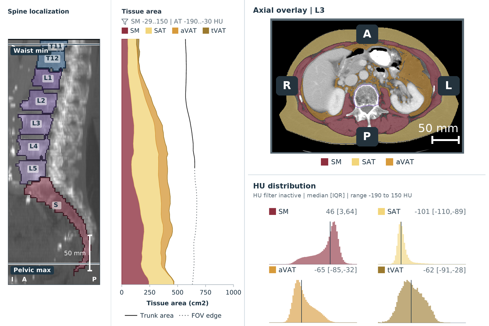

# BodyComposition

BodyComposition is a research pipeline for reproducible analysis of CT body
composition. One validated service drives both the Python API and the
`bodycomposition` command. The default workflow checks CT orientation with
CTDeepRot, identifies vertebral bodies with SPINEPS/VERIDAH, segments
anatomical body-composition compartments, and exports native-millimetre
per-slice and vertebral summaries,
QC artifacts, provenance, and optional one-page PDF reports.

## Example output



*README overview derived from the current one-page patient report for CT-ORG
volume 0. It combines sagittal vertebral-body localization, longitudinal
HU-filtered tissue areas, an axial tissue overlay, and model-native compartment
HU distributions. The aligned spine and tissue-area panels and the HU plots
were rearranged deterministically from the current report. The axial overlay
was regenerated from the same retained CT and segmentation masks at finer
display resolution; see the
[complete patient-page screenshot](docs/assets/pipeline-report-example.png) for
the full table, metadata, and QC notes. CT source: Rister et al.,
[CT-ORG](https://doi.org/10.7937/TCIA.2019.TT7F4V7O), The Cancer Imaging
Archive (2019), licensed under
[CC BY 3.0](https://creativecommons.org/licenses/by/3.0/). These automated
pipeline outputs are not dataset ground truth; exact values belong to the
validated result bundle, not this overview image. The CT-derived panels remain
subject to CC BY 3.0 and are not relicensed under the project's Apache-2.0
license.*

## Release-candidate status

Version `1.0.0rc1` defines one supported configuration, service, Python API,
and command-line interface. See the [changelog](CHANGELOG.md) for migration
details.

The default ResEncL and selectable ResEncM compartment models are synchronized from
their original public Hugging Face repositories at immutable revisions. Every
required file has a pinned byte size and SHA-256 digest. No model weights are
included in Git, the wheel, the source archive, or the container.

## Local installation

Python 3.11 and [uv](https://docs.astral.sh/uv/) are required.

```bash
uv sync --frozen
uv run bodycomposition --version
```

The lockfile is the sole dependency source of truth. Do not layer a separate
`pip install` over this environment.

Model assets live outside the project. Set the cache explicitly when desired:

```bash
export BODYCOMPOSITION_MODEL_ROOT="$HOME/.cache/bodycomposition/models"
uv run bodycomposition models list --json
uv run bodycomposition models sync
uv run bodycomposition models verify --json
uv run bodycomposition doctor --json
```

Synchronization uses exact original upstream URLs or immutable repository
revisions, verifies byte size and SHA-256, and installs atomically. Inference
never downloads a missing model and never falls back to another backend. See
[Model setup and licensing](docs/models.md) before hydrating assets.

## Analyze one CT

Input is one explicit 3-D NIfTI file or one DICOM CT series. A DICOM file or a
directory containing exactly one CT series can be analyzed directly:

```bash
uv run bodycomposition analyze ./input/case-001.nii.gz
uv run bodycomposition analyze ./input/case-002-dicom
```

That is the complete standard command. It uses the validated configuration,
selects CPU or CUDA automatically, derives a content-based pseudonymous case
ID, and writes results below `./output`. DICOM conversion preserves the GDCM
physical domain; the orientation stage still performs all orientation
assessment and any supported repair. When a directory contains multiple CT
series, select one explicitly:

```bash
uv run bodycomposition analyze ./input/case-002-dicom \
  --series 1.2.826.0.1.3680043.10.123.456
```

Use other explicit options only when needed:

```bash
uv run bodycomposition analyze ./input/case-001.nii.gz \
  -o ./another-output -c bodycomposition.yaml \
  --case-id case-001 --device cuda --json
```

Supplied case IDs must already be pseudonymous and path-safe. Machine-readable
JSON is written to stdout; logs are written to stderr. Exit codes are `0`
success, `2` usage/configuration, `3` environment or model readiness, and `4`
execution failure. Canonical Parquet tables and convenient CSV copies are
written by default. Add `--no-csv` to `analyze` or `batch` when only the
canonical representation is needed.

For a machine with limited memory, use the L3-only ResEncM preset:

```bash
uv run bodycomposition models sync --low-resource
uv run bodycomposition analyze ./input/case-001.nii.gz --low-resource
```

Orientation assessment and vertebral localization still use the complete CT.
After L3 is identified, compartment inference keeps the full axial field of view
but limits the z range to L3 plus model context; only the L3 territory is
retained for measurements. The crop does not resize pixels, and masks are
restored to the prepared CT grid. This mode is intended for L3 phenotyping,
not full longitudinal signatures or waist/pelvic measures. See
[Low-resource L3 analysis](docs/low-resource.md).

An optional BOA Task 542 tissue backend can be synchronized from its original
release and selected explicitly. This does not change the default pipeline:

```bash
uv run bodycomposition models sync --model boa_body_regions_task542_v1
uv run bodycomposition analyze ./input/case-001.nii.gz \
  --tissue-backend boa_body_regions_task542_v1
```

The BOA weights remain in the external model directory and are never copied
into the package or container. Its native body-region labels and derived
body-composition tissues have distinct documented semantics; see
[Model setup and licensing](docs/models.md) and [Canonical labels](docs/labels.md).

## Observed performance

On an NVIDIA GB10 running one containerized GPU worker, the validated default
pipeline processed a heterogeneous 100-case cohort in 10 hours and 1 minute:
360.3 seconds per case on average, 327.2 seconds median, and 9.98 cases per
hour. Observed peak host memory was 34.0 GiB and reported GPU-process memory was
16.0 GiB, without material growth over the run. A same-scan comparison on one
public 512-by-512-by-75 CT took 220.1 seconds with the default workflow and
52.5 seconds with `--low-resource`.

On a 10-core Apple M1 Max with 64 GiB unified memory, using CPU inference on
the same public CT, the exact current candidate took 4,163.1 seconds (69.4
minutes) with the default workflow and 440.8 seconds (7.3 minutes) with
`--low-resource`. Peak summed process-tree RSS was 52.0 GiB and 24.9 GiB,
respectively; total used system memory increased by 24.3 GiB and 17.9 GiB from
the start of each run. macOS did not expose a usable unique-set-size counter,
so summed RSS can count shared pages more than once and the system delta can
include other host activity.

In Linux x86-64 Singularity runs of that public CT, five measured processes
after one warm-up averaged 398.6 seconds for the default workflow and 110.6
seconds for `--low-resource` on an NVIDIA A100-SXM4-40GB. The corresponding
NVIDIA B200 averages were 329.6 and 96.4 seconds. Maximum observed GPU memory
was 30.7/5.1 GiB on the A100 and 19.0/4.1 GiB on the B200 for default/low-
resource, respectively. All result bundles passed inspection and the paired
cross-GPU comparison.

These are measurements, not minimum RAM or VRAM requirements. Scan coverage,
hardware, storage, model caching, and analysis scope affect both runtime and
memory. See [Performance and resource observations](docs/performance.md) for
the evidence boundary, variation across repetitions, and hardware details.

For conversion without analysis, use the same validated reader:

```bash
uv run bodycomposition convert ./input/case-002-dicom ./input/case-002.nii.gz
```

This writes `case-002.nii.gz` and a small
`case-002.bodycomposition.json` sidecar. Transfer both files together. On the
analysis machine, point the ordinary command at the NIfTI; the sidecar is found
and verified automatically:

```bash
uv run bodycomposition analyze ./input/case-002.nii.gz
```

The NIfTI preserves CT pixels and physical geometry. The sidecar retains only
privacy-safe technical DICOM provenance; it does not contain patient, study,
accession, date, free-text, source-path, or raw Series UID fields.

The converter is not a DICOM de-identification tool and does not detect or
remove burned-in pixel annotations. See [DICOM input and conversion](docs/dicom.md).

## Analyze an ordered batch

```json
{
  "schema_version": "1.0.0",
  "cases": [
    {"case_id": "case-001", "input_path": "input/case-001.nii.gz"},
    {
      "case_id": "case-002",
      "input_path": "input/case-002-dicom",
      "series_uid": "1.2.826.0.1.3680043.10.123.456"
    }
  ]
}
```

Paths are resolved relative to the manifest. Case order is preserved.

```bash
uv run bodycomposition batch cohort.json
```

Each process executes one complete case at a time. Multiple identical commands
can share the filesystem-backed case queue; the launcher assigns GPUs and
starts processes. See [Execution and accelerator policy](docs/execution.md).

## Python API

```python
from BodyComposition import analyze_case, convert_dicom, inspect_result

result = analyze_case("input/case-001.nii.gz")
limited = analyze_case("input/case-003.nii.gz", low_resource=True)
converted = convert_dicom("input/case-002-dicom", "input/case-002.nii.gz")

assert result.succeeded
verified = inspect_result(result.manifest_path)
tissue_mask = result.output_path / "masks" / "tissue_labels.nii.gz"
```

The API uses the same defaults and `./output` result root as the CLI. Advanced
callers can pass `output_root`, `config`, `case_id`, and `run_id` explicitly;
`config` accepts a `PipelineConfig`, a strict mapping, or a YAML path. Pass
`series_uid` only when a DICOM input contains multiple CT series.

`CaseResult` and `BatchResult` are immutable terminal results. Inspection
validates the manifest schema and every declared artifact size and SHA-256.
The public API never exposes the pipeline's internal action-memory dictionary.

## Container

Build a provenance-labelled image for the current host architecture:

```bash
uv run python scripts/build_container.py \
  --tag bodycomposition:1.0.0rc1
```

The helper derives the package version, source revision, lock digest, canonical
source-context digest, and source date from the checkout. It refuses a dirty
release build. A registry build for both supported Linux architectures uses:

```bash
uv run python scripts/build_container.py \
  --platform linux/amd64,linux/arm64 \
  --tag registry.example.org/bodycomposition:1.0.0rc1 \
  --push
```

The pushed manifest receives BuildKit provenance and SBOM attestations. Audit a
locally loaded platform image and create CycloneDX plus vulnerability receipts
before release:

```bash
uv run python scripts/container_checks.py bodycomposition:1.0.0rc1
```

The image runs as UID/GID `10001`, contains no weights or medical-image test
assets, and expects writable mounts at `/models` and `/output`:

```bash
mkdir -p models output
docker run --rm \
  -v "$PWD/models:/models" \
  bodycomposition:1.0.0rc1 models sync

docker run --rm --gpus all \
  -v "$PWD/input:/input:ro" \
  -v "$PWD/output:/output" \
  -v "$PWD/models:/models:ro" \
  bodycomposition:1.0.0rc1 analyze \
  /input/case-001.nii.gz \
  --case-id case-001 \
  --device cuda --json
```

On Linux, ensure the mounted writable directories permit UID/GID `10001`.
The frozen PyTorch runtime uses CUDA 13.0; NVIDIA driver branch R580 or newer is
required for CUDA execution. `bodycomposition doctor --device cuda --json`
fails before inference when CUDA is not visible. CPU execution remains
available without NVIDIA runtime integration.
Validated and pending platform targets are listed in
[known limitations](docs/known-limitations.md).

## Outputs and review

Successful cases are immutable content-addressed bundles below
`runs/<run-id>/cases/<case-id>/<analysis-id>/`. Failed attempts are retained
separately. The canonical tables are:

- `tables/slices.parquet`: one row per physical CT slice;
- `tables/vertebrae.parquet`: native vertebral territories with three physical
  bins per detected vertebra, including T13, L6, and sacrum when present;
- `tables/summaries.parquet`: established case-level summaries;
- `tables/signature.parquet`: 100 fixed 20-mm bins with explicitly named
  native-compartment and HU-filtered-tissue CSA/HU channels, vertebral
  anchoring, coverage, and alignment confidence; and
- `tables/hu_distributions.parquet`: analyzed-volume 5-HU distributions and exact
  attenuation summaries for the native SM, SAT, aVAT, and tVAT channels that
  the selected backend actually provides; unsupported native channels remain
  explicit missing values rather than being inferred from a different region.

Each table is also exported as a same-name `.csv` file by default for direct
use in spreadsheet software, R, and simple scripts. CSV files have the same
rows and columns, but Parquet remains authoritative because it preserves types,
nullable values, schema metadata, and identity validation. Use `--no-csv` to
avoid the duplicate files. A verified Parquet-only case can be converted later
without changing its immutable result bundle:

```bash
uv run bodycomposition results export-csv \
  output/runs/<run-id>/cases/<case-id>/<analysis-id>/case_manifest.json \
  --output ./csv/<case-id>
```

Together, `signature.parquet` and `hu_distributions.parquet` form the default
comparison signature. They share the case, run, analysis, and measurement
schema identity; the global histogram rows are not duplicated into every
longitudinal bin.

Only vertebral-body masks feed downstream measurement and reporting. Full
vertebra/posterior-element masks are retained only as optional upstream/QC
artifacts. Manual-review cases appear in `aggregate/review_queue.parquet` and
its default CSV mirror, and in optional PDF Notes/QC annotations and batch
review summaries.

See the [output schema](docs/output-schema.md), [measurement definitions](docs/measurements.md),
[QC guide](docs/qc-review.md), and [reporting guide](docs/reporting.md).

## Development and release checks

```bash
uv sync --frozen --extra test --extra release
uv run ruff check BodyComposition tests scripts
uv run mypy
uv run pytest
uv run pytest --cov
uv run python scripts/release_checks.py --allow-dirty
```

The final clean-source gate omits `--allow-dirty`. Model integration and the
checksum-pinned public CT test are opt-in because they require external assets
and controlled hardware. See [CONTRIBUTING.md](CONTRIBUTING.md).

## Documentation

- [Configuration](docs/config.md)
- [Pipeline and geometry](docs/pipeline.md)
- [DICOM input and conversion](docs/dicom.md)
- [Models, synchronization, and licenses](docs/models.md)
- [Measurements and tissue definitions](docs/measurements.md)
- [Output and manifest schemas](docs/output-schema.md)
- [QC and manual review](docs/qc-review.md)
- [PDF reporting](docs/reporting.md)
- [Reproducible cohort execution](docs/reproducibility.md)
- [Performance and resource observations](docs/performance.md)
- [Troubleshooting](docs/troubleshooting.md)
- [Model/data cards and known limitations](docs/known-limitations.md)
- [Third-party notices](THIRD_PARTY_NOTICES.md)

## Citation and license

BodyComposition source is Apache-2.0. External dependencies, model weights,
fonts, and data retain their upstream terms and are never relicensed by this
project. Cite BodyComposition and every enabled model listed in the run
provenance. See [CITATION.cff](CITATION.cff) and the packaged
[third-party notices](THIRD_PARTY_NOTICES.md) for exact sources, license
boundaries, redistribution decisions, and required acknowledgments.

BodyComposition is research software, not a medical device, and is not intended
for diagnosis, treatment, or patient management. Its software and outputs may
contain errors and require independent validation and human review.

Parts of this code were implemented using Codex and GPT-5.6.
